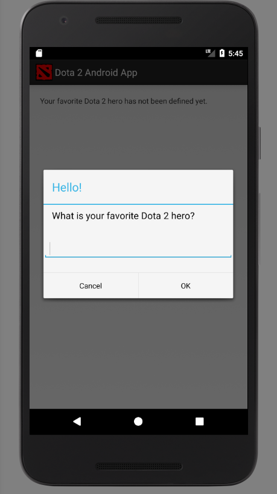

# Dota2AndroidApp

A community project aiming to provide new features and content to the Dota 2 community.

The very first state of the app was developed by completing [this](https://www.raywenderlich.com/132381/kotlin-for-android-an-introduction) tutorial and modifying the example app provided by the tutorial.

## Building and running the app on a virtual Android device

Tested on Windows 10 and Windows 8.1.

### Recommended setup

Clone this repository with the Git tool of your choice. On (most) Unix systems, `git` is preinstalled. To get a simple terminal with common Unix commands and the `git` command for Windows, use [this](https://git-for-windows.github.io/).

Download Android Studio from [here](https://developer.android.com/studio/index.html). Click on `Download Options` or scroll all the way down to download it for Mac or Linux.

Start the installer and install Android Studio with the recommended preconfigured virtual Android device. When this installation is finished and you start Android Studio for the first time, strangely enough another installation starts (probably). Use the recommended settings again. (TODO: Might need custom settings to actually install preconfigured virtual Android device, test it again.)

In Android Studio, choose `Open an existing Android Studio project` and open the `Dota2AndroidApp` folder which you received by cloning this repository earlier. When presented with a window titled "Gradle Sync", click `OK`. When presented with a Windows Firewall window, click `Allow access`. When presented with the "Tip of the Day" window, click `Close`.

Now you are probably presented with an error "Failed to find target [...]". Click `Install missing platform(s) and sync project`. Accept the agreement and click `Next`, when it's done click `Finish`. If you are presented with other errors like this, proceed the same way to install all missing components.

Wait for Android Studio to build the project. When it's done, you will see "Gradle build finished [...]" in a status bar at the bottom of Android Studio. This completes building the app.

## Running the app

Click the green play button in the middle of the toolbar (or press Shift+F10) to run the app. When presented with "Select Deployment Target", you should see an entry under "Available Virtual Devices". If yes, click `OK`. If no, click `Create New Virtual Device`, install missing components, click `Next`, click `Download` to install a recommended system image, click `Next` and click `Finish`. Now you should definitely see an entry under "Available Virtual Devices", then click `OK`.

Watch Android Studio start the virtual Android device to run the app. Follow the status bar at the bottom of Android Studio, it gives you some nice information about what's currently happening. When presented with a window titled "GPU Driver Issue", select `Never show this again` and click `OK`.

The app should now be started on the virtual Android device, giving you a display almost identical or similar to:

If you see this screen, your setup is complete.

## Using the app

Click into the text edit field, enter your favorite Dota 2 hero with the Android keyboard and click `OK`. Now, the text in the app should show what you entered. Close and restart the app (in the virtual Android device or via Android Studio), now it should show what you entered before immediately, without asking you to enter anything.

In the virtual Android device, go to "Settings" and uninstall the "Dota 2 Android App". Run the app again via Android Studio, now you should be able to enter a new hero.
